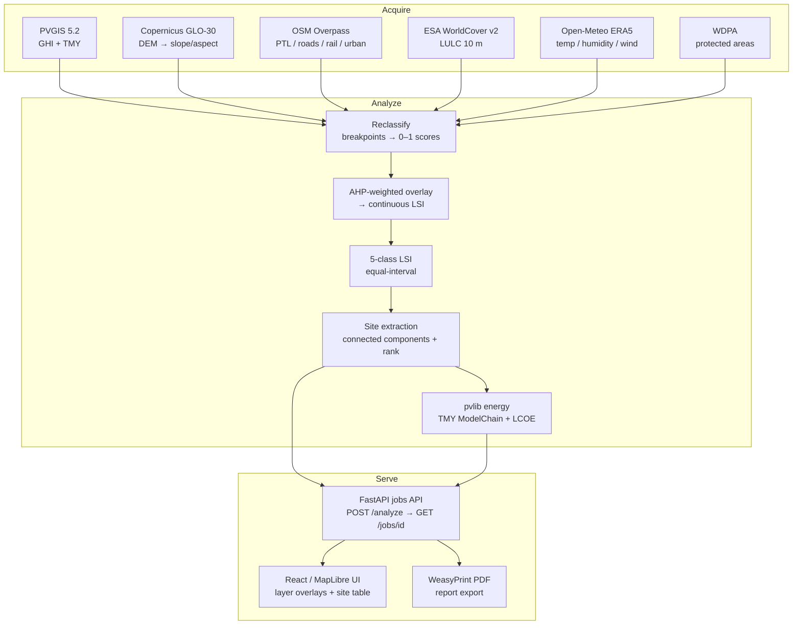

# SolarSiteSelection

[](https://github.com/m7mdehab/SolarSiteSelection/actions/workflows/ci.yml)
[](https://www.python.org/downloads/release/python-3110/)
[](LICENSE)

**Draw an area on a map, get a defensible PV siting analysis.**

<!-- demo GIF is added at deploy time once the hosted instance is live -->


---

## What it does

SolarSiteSelection is a web-based geospatial engine for photovoltaic site selection.
A user draws an area of interest (AOI) on a MapLibre map; the system acquires all
required geodata from public APIs, runs a consistency-checked Analytic Hierarchy
Process (AHP) multi-criteria analysis, and produces a five-class Land Suitability
Index (LSI) raster, ranked candidate site polygons, and per-site pvlib energy/LCOE
estimates — all exportable as a WeasyPrint PDF.

The pipeline has three stages:

**Acquire** — six open data sources are queried automatically for the drawn AOI:
PVGIS 5.2 (annual GHI, TMY), Copernicus GLO-30 DEM (elevation, slope, aspect),
OSM/Overpass (power transmission lines, roads, railways, urban areas), ESA
WorldCover v2 2021 (land cover), Open-Meteo ERA5 reanalysis (temperature,
humidity, wind speed), and WDPA (protected-area exclusion polygons). All results
are cached to disk so repeat analyses over the same AOI are instantaneous.

**Analyze** — the acquired rasters are reclassified to 0–1 suitability scores
according to the breakpoint and class-score tables in `configs/criteria.yaml`.
An AHP-weighted overlay aggregates twelve criteria across three groups (Economic
50%, Technical 25%, Environmental 25%) into a continuous LSI. Hard-exclusion
masks are applied before scoring (protected areas, water bodies, urban cores,
safety buffers). The continuous LSI is classified into five labeled classes
(Most Suitable → Least Suitable) and connected-component site extraction
produces ranked candidate polygons.

**Serve** — a FastAPI back-end exposes the pipeline as an async job API
(submit → poll → fetch layer PNGs, sites GeoJSON, and PDF report). A
React/MapLibre single-page application is served from the same container on
port 7860.

---

## Architecture



---

## Quickstart

### Install and check

```bash
uv sync
make check        # lint + type-check + unit tests (no network)
```

### Run the API locally

```bash
make run          # uvicorn on http://localhost:7860
```

### Run the offline demo

First seed the disk cache from the live APIs (one-time, ~30 s):

```bash
uv run python scripts/demo_aoi.py \
    --aoi tests/fixtures/nw_coast_aoi.geojson \
    --resolution 500
```

Then reproduce the full analysis entirely from cache, no network:

```bash
uv run python scripts/demo_aoi.py \
    --aoi tests/fixtures/nw_coast_aoi.geojson \
    --offline
```

### Docker

```bash
docker compose up          # builds image + starts on http://localhost:7860
```

The container serves both the API and the pre-built React SPA from the same
process on port 7860. The health endpoint is `GET /health`.

---

## Validation against Habib et al. 2020

The engine is validated against the one verbatim public quantitative figure from
Habib, S.M., Suliman, A.E.E., Al Nahry, A.H., & Abd El Rahman, E.N. (2020),
"Spatial modeling for the optimum site selection of solar photovoltaics power
plant in the northwest coast of Egypt," *Remote Sensing Applications: Society and
Environment*, 18, 100313. DOI: [10.1016/j.rsase.2020.100313](https://doi.org/10.1016/j.rsase.2020.100313)

### Our LSI class distribution (NW coast AOI, 500 m, 5 274 valid cells)

| Class | Label | % of valid area | Area (km²) |
|------:|-------|----------------:|-----------:|
| 5 | Most suitable | 34.22% | 1,807.0 |
| 4 | Highly suitable | 55.26% | 2,918.1 |
| 3 | Moderately suitable | 10.21% | 539.2 |
| 2 | Marginally suitable | 0.02% | 1.1 |
| 1 | Least suitable | 0.29% | 15.3 |

### Comparison with the published anchor

| Interpretation | Our value | Paper anchor | Difference |
|---------------|----------:|-------------:|-----------:|
| Top class only (class 5 = "Most suitable") | **34.22%** | 24.9% | +9.3 pp |
| Top two classes (classes 4+5) | 89.48% | 24.9% | — |

The paper's "more suitable" figure (24.9%, 261.2 km²) maps to our class 5.
The +9.3 percentage-point gap is expected: our AOI is approximately five times
larger than the paper's (~5,281 km² vs ~1,048 km²), our data sources are 3–6
years more recent, and we use documented MCDA default weights rather than the
paper's paywalled AHP matrices (see [Validation caveats](#limitations) and the
full analysis in [`docs/validation/README.md`](docs/validation/README.md)).

---

## Tech stack

| Layer | Technology |
|-------|-----------|
| Backend API | FastAPI 0.111, Python 3.11 |
| Analysis engine | rasterio, xarray, rioxarray, geopandas, pvlib, scipy, numpy |
| AHP solver | Custom Saaty eigenvector implementation (`src/solarsite/analysis/ahp.py`) |
| Frontend | React 18, MapLibre GL JS, Vite |
| PDF export | WeasyPrint |
| Data cache | xarray/NetCDF + GeoPackage on disk (`data/cache/`) |
| Container | Docker multi-stage (Node 20 + Python 3.11-slim), port 7860 |
| Dependency management | uv + pyproject.toml |
| CI | GitHub Actions — lint (ruff), type-check (pyright), unit tests (pytest) |

For the full criteria derivation and AHP methodology, see
[`docs/methodology.md`](docs/methodology.md).

For a narrative history of design decisions, see
[`docs/history.md`](docs/history.md).

---

## Limitations

**Data vintages.** The reference paper (Habib et al. 2020) used data from
approximately 2018. This engine uses ESA WorldCover v2 2021, PVGIS 5.2
(2005–2020 climatology), Copernicus GLO-30 (2021–2022), and Open-Meteo ERA5
reanalysis (2021–2024). Land cover classifications and infrastructure locations
along the Matrouh coast have changed in that interval.

**Point-interpolated climate layers.** PVGIS and Open-Meteo deliver data at
discrete sample points, not as continuous rasters. Both sources are queried on
a coarse lattice over the AOI (default 5×5 = 25 points for PVGIS; adaptive
density for Open-Meteo) and bilinearly interpolated to the analysis grid. This
produces smooth fields that understate local climate variability. At the 500 m
analysis resolution used for validation, the effect is minor because climate
gradients over the NW Egypt coast are gentle.

**AHP subjectivity.** The group weights (Economic 50%, Technical 25%,
Environmental 25%) and within-group local weights are documented MCDA defaults
drawn from mainstream PV-siting literature (Al Garni & Awasthi 2017;
Sánchez-Lozano et al. 2013). They are **not** the weights published by Habib
et al. 2020; those pairwise comparison matrices are accessible only through the
journal paywall. The weights are fully editable via the AHP editor in the UI,
and any pairwise matrix with CR > 0.10 is rejected.

**LCOE simplifications.** Energy and economics calculations use fixed defaults:
1,000 USD/kWp CAPEX, 17 USD/kWp/yr OPEX, 7% real WACC, 25-year lifetime, and
45 MWp/km² packing density. Actual project economics depend on site-specific
land, grid-connection, and financing costs not captured in these values.

**Proxy and not-yet-sourced layers.** Two criteria in the registry currently
have no matching acquired data layer: `shadow` (shading frequency, proxied
from terrain in the analysis but not yet acquired as a dedicated layer) and
`land_capability` (USDA land capability class, no public global API available).
Their combined global weight (~6.25%) is redistributed to present criteria.
This biases LSI upward in areas that may be shadowed or on high-capability
agricultural land.

---

*Full validation details and discussion of all divergences:
[`docs/validation/README.md`](docs/validation/README.md)*
