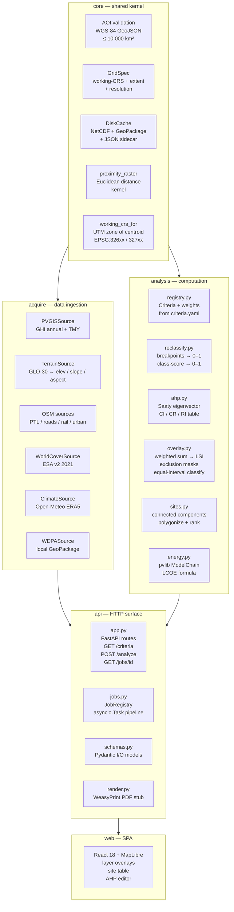

# Architecture

This document describes the layered design of SolarSiteSelection, the
acquisition contract, the in-process job model, the working-CRS/grid policy,
and the disk cache.

---

## Layered design

The kernel (`core`) has no dependencies on `acquire`, `analysis`, or `api`.
`acquire` depends only on `core`. `analysis` depends on `core` and reads
`configs/criteria.yaml` via `registry.py`. `api` wires `acquire` and `analysis`
together and exposes HTTP routes. `web` communicates only with `api`.

---

## The acquisition contract

Every data source implements one of two abstract base classes from
`src/solarsite/acquire/base.py`:

- **`RasterSource`** — fetches a layer as an `xarray.DataArray` aligned to the
  working-CRS grid for the given AOI and resolution. Calls `_fetch_uncached`
  and wraps it with DiskCache. Concrete implementations: `PVGISSource`,
  `TerrainSource`, `WorldCoverSource`, `ClimateSource`.

- **`VectorSource`** — fetches features as a `geopandas.GeoDataFrame` in the
  working CRS. Concrete implementations: `OSMPowerSource`, `OSMRoadsSource`,
  `OSMRailwaySource`, `OSMUrbanSource`, `WDPASource`.

The public entry point for both is `source.fetch(aoi, resolution_m)`. All
network calls go through `request_with_retry`, which applies exponential backoff
on HTTP 429 and 504 responses (up to 4 retries, starting at 1.5 s). Large OSM
AOIs (> 2,500 km²) are split into a 2×2 tile grid to avoid Overpass gateway
timeouts.

Acquisition is resilient: a source that fails is skipped with a warning and
reported in the job state; the analysis proceeds on whichever layers are
available, redistributing weights.

---

## Working-CRS and grid policy

All analysis is performed in a single **UTM zone** determined by the centroid of
the AOI:

    EPSG = 32600 + zone  (Northern Hemisphere)
    EPSG = 32700 + zone  (Southern Hemisphere)

UTM gives metric units with low distortion (< 0.04% within a zone) and is valid
for any AOI up to the 10,000 km² limit. Egypt spans UTM zones 35N and 36N; the
centroid-based selection handles the zone boundary automatically.

A **`GridSpec`** (defined in `src/solarsite/core/grid.py`) captures the CRS,
bounding box in the working CRS, and pixel resolution (default 100 m, validation
runs at 500 m). Every raster layer is aligned to the same `GridSpec` before the
analysis stage, ensuring pixel-exact registration.

The WDPA and OSM vector layers are reprojected to the working CRS via
`geopandas.GeoDataFrame.to_crs()` before rasterisation.

---

## In-process job model

Each analysis request becomes an `asyncio.Task` inside the FastAPI process.
No external task queue is required; the design trades horizontal scalability for
operational simplicity (single-container deployment on Hugging Face Spaces).

**Job lifecycle:**

1. `POST /analyze` — validates AOI (WGS-84 GeoJSON, ≤ 10,000 km²), creates a
   `_JobRecord` with a UUID job ID, starts the pipeline task, returns 202 with
   `job_id`.
2. The task iterates over `ACQUIRE_SOURCES` (ordered list), updating each
   source's `AcquireSourceStage` status (`queued → running → done / failed`).
3. Analysis stages run sequentially after acquisition:
   reclassify → `weighted_overlay` → `classify_lsi` → `extract_sites` →
   `site_energy` per candidate site.
4. Artefacts are persisted to `data/jobs/{id}/`: layer NetCDF files, colormapped
   PNG files (one per criterion + LSI), `sites.geojson`, and `report.pdf`.
5. `GET /jobs/{id}` returns full staged progress; the React UI polls this until
   status is `done` or `error`.
6. `GET /jobs/{id}/layers/{name}.png` streams the PNG with `X-Layer-Bounds`
   header for MapLibre placement. `GET /jobs/{id}/sites.geojson` streams the
   ranked candidates. `GET /jobs/{id}/report.pdf` streams the PDF.

The `layer_provider` is an injectable callable that is the seam for testing.
Tests inject a synthetic provider that returns pre-built DataArrays without any
network calls; production uses `default_layer_provider` which wraps
`scripts/demo_aoi.py::build_dataset`.

---

## Disk cache

`src/solarsite/core/cache.py` implements a file-backed cache keyed on
`(source, aoi_hash, params)`.

- **DataArrays** are stored as NetCDF (`.nc`) files plus a JSON sidecar
  recording the key metadata.
- **GeoDataFrames** are stored as GeoPackage (`.gpkg`) files plus a JSON
  sidecar.

The cache root defaults to `data/cache/` (gitignored). The demo preset AOI
cache (`data/cache/`) is seeded offline via
`scripts/demo_aoi.py --aoi tests/fixtures/nw_coast_aoi.geojson --resolution 500`
and can then be replayed with `--offline` for zero-network analysis.

Cache invalidation is explicit: clearing `data/cache/` forces a full re-fetch.
There is no TTL; cached entries are valid indefinitely unless the cache directory
is wiped or the `aoi_hash` / `params` change.

---

## Frontend and container

The React/MapLibre SPA is built by Node 20/Vite in a multi-stage Docker build.
The static `dist/` bundle is copied into the Python runtime image and served by
FastAPI's `StaticFiles` mount at `/`. API routes defined before the static mount
take precedence.

The container exposes a single port (7860) and includes a Python-based
healthcheck polling `GET /health`. The `SOLARSITE_WEB_DIST` environment variable
can override the frontend path.

---

*See also: [`docs/methodology.md`](methodology.md) for the criteria and AHP
derivation, [`docs/validation/README.md`](validation/README.md) for validation
results.*
